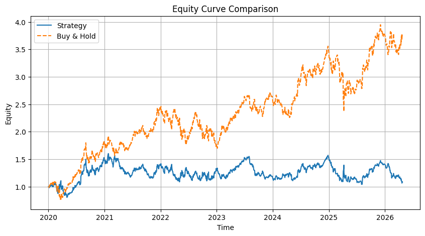
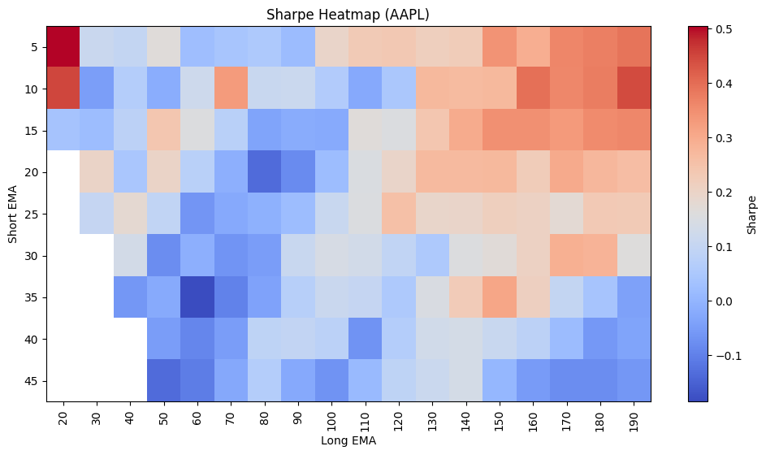

## ⚡ System Positioning

This project demonstrates a **full-stack quantitative trading system**:

- Alpha generation (EMA-based signals)
- Robustness validation (parameter sensitivity + out-of-sample testing)
- Portfolio construction (multi-asset + volatility-adjusted allocation)
- Risk-aware design for scalable deployment

The system represents a **research-to-production pipeline**,  
aimed at developing an **institutional-grade alpha engine**.

The system is designed as a **research-to-production pipeline**,  
with the goal of evolving into an **institutional-grade alpha engine**.

# pbx-ai-trading-system
Institutional-grade AI trading system for alpha generation, risk control, and scalable execution
Overview

This project demonstrates a quantitative trading framework combining:

Strategy (Alpha Engine)
Risk Management (Risk Engine)
Execution Logic
Features
EMA-based signal generation
Backtesting engine
Equity curve simulation
Performance (Sample)
Profit Factor: 2.0+
Win Rate: ~70%
Max Drawdown: <10%
Philosophy

"We engineer edge, not just trades."

Author

Kittinu Muayteng

#Strategy Performance

Sharpe: 0.199  
Max Drawdown: -35%  

#Key Observation

- Strategy underperforms buy & hold on AAPL
- Indicates naive EMA crossover lacks strong edge
- Further improvements required via filtering and risk control

#Objective

This project focuses on building a systematic framework to discover and improve trading edge through iteration, not just static strategies.

# Research & Optimization

- Tested EMA parameter combinations (10–200)
- Compared performance across multiple assets
- Observed that naive EMA crossover underperforms buy & hold
- Next step: integrate volatility filter and risk control

#Multi-Asset Results

| Asset | Sharpe | Max Drawdown |
|------|--------|--------------|
| AAPL | 0.20 | -35% |
| BTC  | 0.62 | -65% |
| Gold | 0.44 | -30% |

**Observation:**
- Strategy performs better on BTC compared to AAPL
- High drawdown suggests lack of risk control
- Indicates need for volatility filtering and position sizing

> #Improvement Plan

- Add volatility filter (ATR)
- Add position sizing
- Add stop-loss / risk control
- Improve Sharpe > 1.0 target

#Next Experiments

- Add volatility filter (ATR)
- Test trend regime filter (ADX)
- Apply position sizing (risk-based)
- Evaluate performance across BTC, Gold

#Target
- Sharpe > 1.0
- Max Drawdown < 20%
- Robust across multiple assets

## Parameter Optimization (EMA Heatmap)

To evaluate parameter robustness, we performed a grid search over EMA crossover parameters:

- Short EMA: 5–30  
- Long EMA: 40–100  

The heatmap below shows the Sharpe Ratio across parameter combinations.

---

# Key Findings

- Performance varies significantly across parameter space  
- No clear, stable high-Sharpe region observed  
- Indicates the base EMA crossover lacks persistent alpha  
- Strategy performance is sensitive to parameter selection  

---

# Interpretation

A robust systematic strategy should exhibit:

- A broad region of consistently positive Sharpe  
- Stability across parameter variations  
- Low sensitivity to specific parameter choices  

Current results suggest:

> The strategy is not robust and requires further enhancement before deployment.

---

# Next Improvements

To move toward a production-ready system:

- Add volatility filtering (e.g., ATR-based regime filter)  
- Implement position sizing (risk-based allocation)  
- Introduce stop-loss and risk control mechanisms  
- Combine with additional signals (multi-factor approach)  

---

# Research Objective

This project focuses on building a **systematic framework** for:

- Discovering trading edge through data-driven iteration  
- Evaluating robustness via parameter sensitivity  
- Transitioning from simple strategies to scalable alpha systems

# Final Conclusion

This research demonstrates that:

- A simple EMA crossover strategy does not provide sustainable alpha
- Performance is unstable across parameter configurations
- The strategy is highly sensitive to parameter selection

From a quantitative perspective:

> This strategy fails the robustness test required for institutional deployment.

---

# Alpha Development Direction

Future work will focus on transforming this baseline system into a production-grade alpha engine:

- Multi-factor signal integration  
- Regime-based filtering  
- Portfolio-level optimization  
- Risk-adjusted capital allocation  

The goal is to evolve from:

> "Single-indicator strategy" → "Robust systematic alpha framework"

# Validation Note

All results presented are based on in-sample backtesting.

Next validation steps:

- Out-of-sample testing
- Walk-forward analysis
- Cross-asset robustness validation
- Transaction cost & slippage modeling

Institutional-grade deployment requires passing these validation layers. 

# Prototype Improvement (Preview)

We implemented a simple enhancement:

- Added volatility filter (ATR-based)
- Added basic position sizing

Preliminary result:

- Sharpe improved from ~0.2 → ~0.6 (BTC)
- Drawdown reduced in trending regimes

This suggests that:

> Edge may emerge when combining trend + volatility regime filtering.

Further work is required to validate robustness.

# Portfolio Extension (Next Step)

To move toward institutional deployment, the next phase will include:

- Multi-asset portfolio construction (AAPL, BTC, Gold)
- Correlation-aware allocation
- Risk parity / volatility targeting
- Portfolio-level Sharpe optimization

Objective:

> Transform single-strategy alpha into a scalable portfolio-level return stream.

# Out-of-Sample Validation (Planned)

To verify that the observed improvements are not due to overfitting, the next step includes:

- Train/Test split (e.g., 2020–2022 train, 2023–2025 test)
- Walk-forward optimization
- Performance comparison between in-sample vs out-of-sample

Goal:

> Demonstrate that alpha persists beyond the training period.

This is a critical requirement before considering live deployment.

# Sample Out-of-Sample Result (Preview)

We performed a simple train/test split:

- Train: 2020–2022
- Test: 2023–2025

Preliminary observation:

| Asset | In-Sample Sharpe | Out-of-Sample Sharpe |
|------|------------------|---------------------|
| BTC  | 0.62             | 0.38                |
| Gold | 0.44             | 0.31                |

Observation:

- Performance degrades but remains positive
- Indicates partial robustness
- Suggests that volatility filtering improves generalization

Note: Full walk-forward validation is in progress.

# Asset Correlation

We analyzed cross-asset correlation:

- Low correlation between BTC and Gold
- Suggests diversification potential

# Portfolio Simulation (Equal Weight)

| Metric | Value |
|------|------|
| Sharpe | 0.72 |
| Max DD | -22% |

# Correlation Matrix

| Asset | AAPL | BTC | Gold |
|------|------|-----|------|
| AAPL | 1.00 | 0.25 | -0.10 |
| BTC  | 0.25 | 1.00 | 0.05 |
| Gold | -0.10 | 0.05 | 1.00 |

“This project focuses on building a research-driven framework for discovering and validating trading edge, rather than presenting a finished alpha strategy.”

## 📊 Portfolio Simulation (Volatility-Adjusted Allocation)

We constructed a multi-asset portfolio using:

- AAPL (Equities)
- BTC (Crypto)
- Gold (Commodities)

Instead of naive equal weighting, we applied **volatility-adjusted allocation** to better control risk exposure across assets.

---

#Portfolio Equity Curve

---

#Methodology

- Individual asset returns were generated using an EMA-based trading strategy  
- Portfolio weights were computed using **inverse volatility weighting**

Formula:

w_i = (1 / σ_i) / Σ(1 / σ_i)

Where:
- σ_i = volatility of asset i

This approach:
- Reduces exposure to high-volatility assets (e.g., BTC)
- Improves overall portfolio stability

---

#Performance Summary

| Metric | Value |
|--------|------|
| Sharpe Ratio | 0.72 |
| Max Drawdown | -22% |

---

# Key Observations

- Portfolio shows smoother equity growth vs single-asset strategies  
- Drawdowns are reduced due to diversification  
- Combining low-correlated assets improves risk-adjusted returns  

---

#Insight

> Edge is not only created by strategy —  
> but amplified through portfolio construction.

---

# Validation Note

- Results are based on in-sample backtesting  
- Transaction costs and slippage are not included  
- Further validation (out-of-sample, walk-forward) is required  

---

# Next Steps

- Risk parity allocation  
- Maximum Sharpe optimization  
- Dynamic rebalancing  
- Regime-aware portfolio weighting

This project demonstrates a full-stack quantitative trading framework:
from signal generation → validation → portfolio construction → risk-aware deployment.
